# 基于Django的学生管理系统
## 说明文档
* 开发环境
* 数据库：SQLite
* 前台界面：Html5+CSS3+javascript
* 后台：python3.5+Django2.2.13

## 部署说明
系统启动步骤
1. 命令行进入项目根目录
2.	`pip3 install -r requirements.txt`
3.	执行命令 python3 manage.py runserver 8000
4.	用浏览器打开http://127.0.0.1/8000

## 测试账号
1.	学生：xs02   密码：02
2.	老师：ls01    密码：01


## 主要功能包括
1. 学生/教师登录  
学生登录成功后可以查看修改自己的详细信息、老师登录后可以增删改查所有学生的信息。
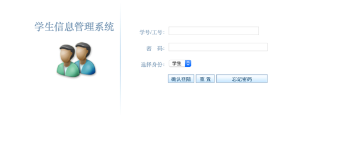
2. 学生查看自己的信息   
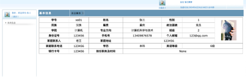
3. 学生修改自己的常用信息  
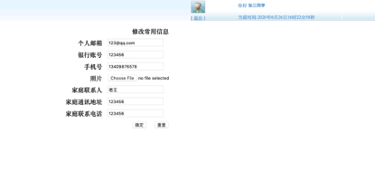
4. 教师查看学生表所有信息并以表格形式显示到页面  
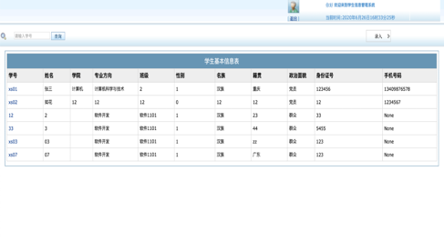
5. 向学生表插入记录  
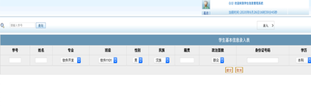
6. 修改指定id（学号）的学生信息  
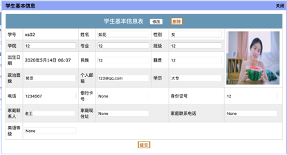 
7. 删除指定id（学号）的学生信息   
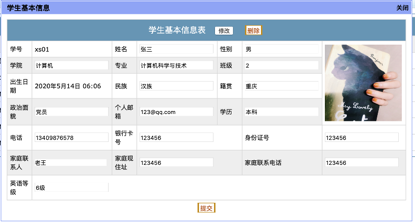

## 代码介绍
### 一、Models

学生信息表模型，定义了学生信息表的字段，包括学号、姓名、性别、出生日期等信息。
```python
class StuBasicInfo(models.Model):
    studentNo = models.ForeignKey(to=StuInfo, on_delete=models.CASCADE, related_name="stu_stu",verbose_name='学号')
    studentName = models.CharField(max_length=18, verbose_name='姓名')
    birthday=models.DateTimeField(verbose_name='出生日期')
    ClassNo = models.ForeignKey(to=ClassInfo, on_delete=models.CASCADE, verbose_name='班级编号',related_name='cla')
    ClassName=models.CharField(max_length=30,verbose_name='班级')
    major=models.CharField(max_length=30,verbose_name='专业方向')
    college=models.CharField(max_length=30,verbose_name='学院')
    sex=models.IntegerField(verbose_name='性别')
    nation=models.CharField(max_length=30,verbose_name='名族')
    hometown=models.CharField(max_length=84,verbose_name='籍贯')
    political=models.CharField(max_length=24,verbose_name='政治面貌')
    idcard=models.CharField(max_length=18,verbose_name='身份证号')
    telephone=models.CharField(max_length=11,blank=True, null=True,verbose_name='手机号')
    email = models.CharField(max_length=50, blank=True, null=True, verbose_name='个人邮箱')
    emailOnly = models.IntegerField(verbose_name='邮箱绑定',default=0)
    family = models.CharField(max_length=30, blank=True, null=True,verbose_name='家庭联系人')
    address = models.CharField(max_length=60, blank=True, null=True,verbose_name='家庭地址')
    fphone = models.CharField(max_length=18, blank=True, null=True,verbose_name='家庭联系电话')
    photo = models.FileField(upload_to="media/",blank=True, null=True, verbose_name='照片')
    eduBackground = models.CharField(max_length=12, blank=True, null=True,verbose_name='学历')
    englishlevel = models.CharField(max_length=12, blank=True, null=True,verbose_name='英语等级')
    bankcard = models.CharField(max_length=25, blank=True, null=True, verbose_name='银行卡号')
    class Meta:
        verbose_name = '学生基本信息表'
        verbose_name_plural = '学生基本信息表'
    def __str__(self):
        return self.studentName
```

### 二、Views
1. 查看学生表所有信息
```python
class StudentBaseView(View):
    def get(self, request):
        username = request.session['username']
        role = request.session['role']
        if role==1:
            try:
                Stuinfo = StuBasicInfo.objects.get(studentNo=username)
            except Exception as e:
                Stuinfo = []
            return render(request, 'main/files/Student/std_BasicInfo.html', {'Stuinfo': Stuinfo})
        else:
            try:
                classinfo=ClassInfo.objects.get(teacherNo=username)
                Stuinfo_list=classinfo.cla.all()
            except Exception as e:
                Stuinfo = []
            return render(request, 'main/files/teacher/class_basicInfo.html',
                              {"Stuinfo_list": Stuinfo_list, "classinfo": classinfo})
```
2. 向学生表插入记录
```python
class StudentAdd(View):
    def post(self,request):

        data= json.loads(request.POST.get("datats"))
        for obj in data:
            ct=ClassInfo.objects.first()
            try:
                sf=StuInfo.objects.get(studentNo=obj[0])
            except:
                sf=StuInfo()
                sf.studentNo=obj[0]
                sf.save()
            sno = obj[0]
            sname =  obj[1]
            profession =  obj[2]
            classname = obj[3]
            sex =  obj[4]
            nation =  obj[5]
            birthPlace =  obj[6]
            political =  obj[7]
            IDCard =  obj[8]
            schooling =  obj[9]
            cete = obj[10]
            job =  obj[11]
            bandCard =  obj[12]
            stuinfo = StuBasicInfo()
            stuinfo.studentNo=sf
            stuinfo.ClassNo=ct
            stuinfo.studentName=sname
            stuinfo.major=profession
            stuinfo.ClassName=classname
            stuinfo.sex=sex
            stuinfo.nation=nation
            stuinfo.hometown=birthPlace
            stuinfo.political=political
            stuinfo.idcard=IDCard
            stuinfo.eduBackground=schooling
            stuinfo.englishlevel=cete
            stuinfo.bankcard=bandCard
            stuinfo.remarks=job
            stuinfo.birthday=datetime.datetime.now()
            stuinfo.save()
        return HttpResponse('{"status":"success","msg": "11！"}', content_type='application/json')
```
3. 修改指定id（学号）的学生信息
```python
def post(self,request):
    data=QueryDict(request.POST.get("data"))
    sno=data.get("studentNo")
    Stuinfo = StuBasicInfo.objects.filter(studentNo=sno).first()
    political = data.get("political")
    eduBackground = data.get("eduBackground")
    telephone = data.get("telephone")
    bankcard = data.get("bankcard")
    family = data.get("family")
    address = data.get("address")
    englishlevel = data.get("englishlevel")
    fmaily_phone = data.get('family_phone')
    id_card = data.get('id_card')
    email = data.get('email')
    hometown = data.get('hometown')
    nation = data.get('nation')
    college = data.get('college')
    major = data.get('major')
    class_name = data.get('class_name')
    sex = data.get('sex')
    student_name = data.get('student_name')
    Stuinfo.political = political
    Stuinfo.eduBackground = eduBackground
    Stuinfo.telephone = telephone
    Stuinfo.family = family
    Stuinfo.address = address
    Stuinfo.bankcard = bankcard
    Stuinfo.englishlevel=englishlevel
    Stuinfo.fphone = fmaily_phone
    Stuinfo.idcard = id_card
    Stuinfo.email = email
    Stuinfo.hometown = hometown
    Stuinfo.nation = nation
    Stuinfo.college = college
    Stuinfo.major = major
    Stuinfo.ClassName = class_name
    Stuinfo.sex = 1 if sex == "男" else 0
    Stuinfo.studentName = student_name
    Stuinfo.save()
    return HttpResponse('{"status":"success","msg": "修改成功！"}', content_type='application/json')
```
4. 删除指定id（学号的）学生信息
```python
def post(self,request):
    data=QueryDict(request.POST.get("data"))
    sno=data.get("studentNo")
    Stuinfo = StuBasicInfo.objects.filter(studentNo=sno).first()
    is_delete = request.POST.get("is_delete", False)
    if is_delete:
        Stuinfo.delete()
        return HttpResponse('{"status":"success","msg": "删除成功！"}', content_type='application/json')
```
### 三、Templates
1. 显示所有学生信息class_basicInfo.html, 部分代码示例如下  
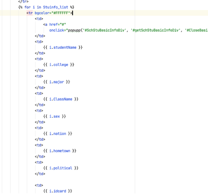
2. 添加学生记录class_advanceInfo.html  
 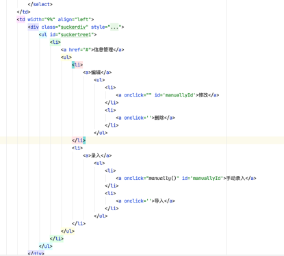
3. 修改指定id（学号）学生信息detail.html  
  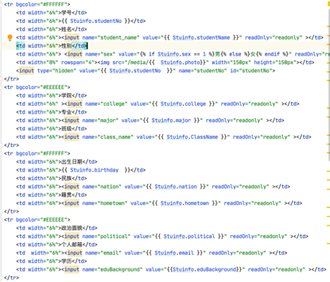
4. 删除指定id（学号）的学生信息class_basicInfo.html  
   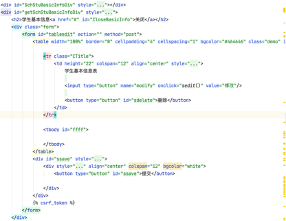

在school.js定义了删除按钮响应函数  
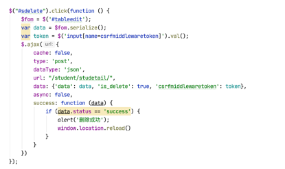

### 四、数据库设置
使用Django自带的SQLite3数据库  
 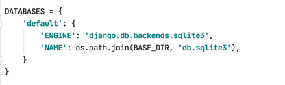
